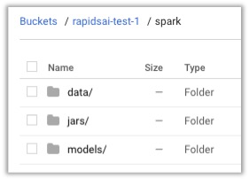

# Get Started with XGBoost4J-Spark on Google Cloud

This is a getting started guide to XGBoost4J-Spark on Google Cloud. At the end of this guide, the reader will be able to run a sample Apache Spark application that runs on NVIDIA GPUs on Google Cloud.

### Install & Cluster Spin up

Then, use the steps from this [blog](https://medium.com/rapids-ai/scale-out-rapids-on-google-cloud-dataproc-8a873233258f) to create a RAPIDS cluster on Dataproc. Specifically, run through the steps in the Install Google Cloud SDK and the Create a Dataproc cluster sections.

Here’s an example command:

```
CLUSTER_NAME=raghav-cluster
ZONE=us-east1-c
STORAGE_BUCKET=rapidsai-test-1
NUM_GPUS_IN_MASTER=4
NUM_GPUS_IN_WORKER=4
NUM_WORKERS=2
DATAPROC_BUCKET=dataproc-initialization-actions

gcloud beta dataproc clusters create $CLUSTER_NAME  \
--zone $ZONE \
--master-accelerator type=nvidia-tesla-t4,count=$NUM_GPUS_IN_MASTER \
--master-machine-type n1-standard-32 \
--worker-accelerator type=nvidia-tesla-t4,count=$NUM_GPUS_IN_WORKER \
--worker-machine-type n1-standard-32 \
--num-workers $NUM_WORKERS \
--bucket $STORAGE_BUCKET \
--metadata "JUPYTER_PORT=8888" \
--initialization-actions gs://$DATAPROC_BUCKET/rapids/rapids.sh \
--optional-components=ANACONDA,JUPYTER \
--enable-component-gateway
```

This cluster should now have NVIDIA drivers and the CUDA run time.

### Submitting Jobs

Set up the jar files and data on a root folder in a GCP storage bucket like below.

You can either drag and drop files from the GCP [storage browser](https://console.cloud.google.com/storage/browser/rapidsai-test-1/?project=nv-ai-infra&organizationId=210881545417), or use the [gsutil cp](https://cloud.google.com/storage/docs/gsutil/commands/cp) to do this from the command line.



### Submit Spark Job on GPUs

Use the following command to submit spark jobs on this GPU cluster.

```
CLUSTER_NAME=raghav-cluster
ROOT_FOLDER=gs://rapidsai-test-1/spark
MAIN_CLASS=ai.rapids.spark.examples.agaricus.GPUMain
RAPIDS_JARS=$ROOT_FOLDER/jars/sample_xgboost_apps-0.1.4.jar,$ROOT_FOLDER/jars/cudf-0.9-cuda10.jar,$ROOT_FOLDER/jars/xgboost4j_2.11-1.0.0-Beta.jar,$ROOT_FOLDER/jars/xgboost4j-spark_2.11-1.0.0-Beta.jar
TRAIN_DATA_PATH=$ROOT_FOLDER/data/agaricus/csv/train
TEST_DATA_PATH=$ROOT_FOLDER/data/agaricus/csv/test
MODEL_PATH=$ROOT_FOLDER/models

gcloud beta dataproc jobs submit spark \
--cluster=$CLUSTER_NAME \
--class=$MAIN_CLASS \
--jars=$RAPIDS_JARS \
--properties=spark.executor.memory=32G,spark.executorEnv.LD_LIBRARY_PATH=/opt/conda/anaconda/envs/RAPIDS/lib/ \
-- \
-format=csv \
-numRound=100 \
-mode=train \
-trainDataPath=$TRAIN_DATA_PATH \
-trainDataPath=$TEST_DATA_PATH \
-modelPath=$MODEL_PATH \
-overwrite=true
```

Here's a quick explanation of key parameters:

- CLUSTER_NAME: name of the cluster you had created in the first step
- ROOT_FOLDER: Storage bucket on GCP where you organize your data and jar files
- MAIN_CLASS: Class containing the main method to run
- RAPIDS_JARS: All the jar files you file need. This includes the RAPIDS jars as well as the one for the application you are submitting.
properties:  Use this to specify Spark properties. The command above includes the ones you likely need.

You can check out the full documentation of this api [here](https://cloud.google.com/sdk/gcloud/reference/beta/dataproc/jobs/submit/spark).

### Submit Spark Job on CPUs

Submitting a CPU job on this cluster is very similar. Below's an example command that runs the same Agaricus application on CPUs:

```
CLUSTER_NAME=raghav-cluster
ROOT_FOLDER=gs://rapidsai-test-1/spark
MAIN_CLASS=ai.rapids.spark.examples.agaricus.CPUMain
RAPIDS_JARS=$ROOT_FOLDER/jars/sample_xgboost_apps-0.1.4.jar,$ROOT_FOLDER/jars/cudf-0.9-cuda10.jar,$ROOT_FOLDER/jars/xgboost4j_2.11-1.0.0-Beta.jar,$ROOT_FOLDER/jars/xgboost4j-spark_2.11-1.0.0-Beta.jar
TRAIN_DATA_PATH=$ROOT_FOLDER/data/agaricus/csv/train
TEST_DATA_PATH=$ROOT_FOLDER/data/agaricus/csv/test
MODEL_PATH=$ROOT_FOLDER/models

gcloud beta dataproc jobs submit spark \
--cluster=$CLUSTER_NAME \
--class=$MAIN_CLASS \
--jars=$RAPIDS_JARS \
--properties=spark.executor.memory=32G \
-- \
-format=csv \
-numRound=100 \
-mode=train \
-trainDataPath=$TRAIN_DATA_PATH \
-trainDataPath=$TEST_DATA_PATH \
-modelPath=$MODEL_PATH \
-overwrite=true \
-numWorkers=12 \
-treeMethod=hist
```

### Clean Up

When you're done working on this cluster, don't forget to delete the cluster, using the following command (replacing the highlighted cluster name with yours):

```
gcloud dataproc clusters delete raghav-cluster
```
